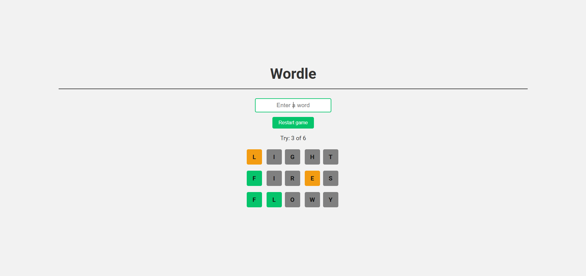
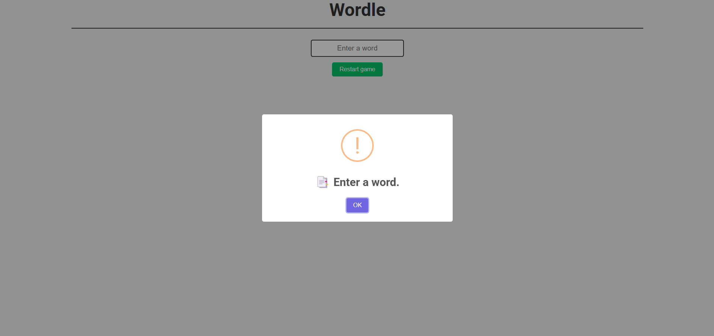
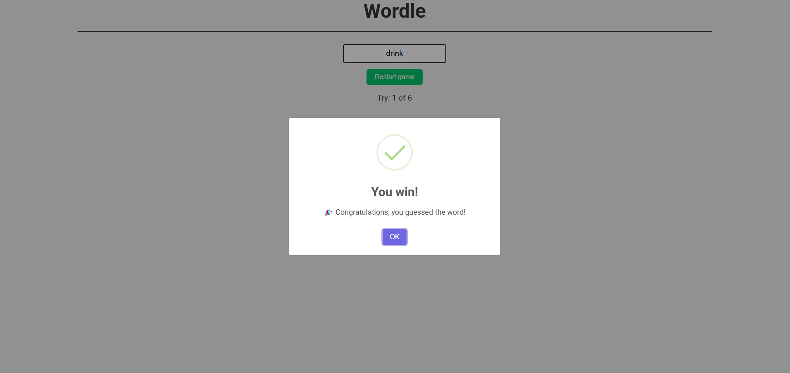

# 📜 Wordle game

Wordle proyect using HTML, CSS and JavaScript!

## 📝 Description
This game is a Wordle clone where you must guess a within attempts. After each attempt:
- ✅ **Green** indicates the letter is in the correct position.
- 🟡 **Yellow** indicates the letter is in the word but in a different position.
- ❌ **Gray** indicates the letter is not in the word.

## 🌍 Website
Try the game online here:  
[🔗 Wordle](https://diegomanildo.github.io/Wordle/)

## 🚀 Installation
1. Clone this repository or download the source code.
2. Open the `index.html` file in your browser.
3. Start playing.

## 🤝 Contributions
Contributions are welcome! If you want to improve the game or add new features:
1. Fork this repository.
2. Create a new branch (`git checkout -b feature/new-feature`).
3. Make changes and commit them with descriptive messages.
4. Submit a Pull Request detailing your contributions.

## 📷 Screenshots

